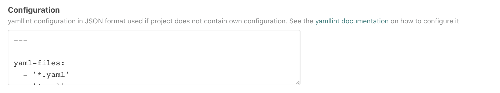

# `atomist/yamllint-skill`

<!---atomist-skill-description:start--->

Find problems in your YAML files

<!---atomist-skill-description:end--->

---

<!---atomist-skill-readme:start--->

# What it's useful for

Get consistency across your YAML files.

* Run [yamllint](https://yamllint.readthedocs.io) with the same 
consistent configuration across all of your projects
* Also supports repository-specific yamllint configurations
* Uses GitHub Checks with code-level annotations for linting rule violations

# Before you get started

Connect and configure these integrations:

1. **GitHub**
1. **Slack or Microsoft Teams**

The **GitHub** integration must be configured in order to use this skill. At
least one repository must be selected. The **Slack** or **Microsoft Teams** 
integration is optional.

# How to configure

1. **Specify an optional yamllint configuration**

    

    Provide the [yamllint configuration](https://yamllint.readthedocs.io/en/stable/configuration.html)
    to be used for linting when a repository does not have its own configuration.

1. **Determine repository scope**

   

   By default, this skill will be enabled for all repositories in all
   organizations you have connected.

   To restrict the organizations or specific repositories on which the skill
   will run, you can explicitly choose organization(s) and repositories.

# How to lint your YAML files

1. **Set up the skill by providing an yamllint configuration**

1. **Commit and push your code changes**

1. **Enjoy automatic linting and fixes!**

To create feature requests or bug reports, create an [issue in the repository for this skill](https://github.com/atomist-skills/yamllint-skill/issues).
See the [code](https://github.com/atomist-skills/yamllint-skill) for the skill.

<!---atomist-skill-readme:end--->

---

Created by [Atomist][atomist].
Need Help?  [Join our Slack workspace][slack].

[atomist]: https://atomist.com/ (Atomist - How Teams Deliver Software)
[slack]: https://join.atomist.com/ (Atomist Community Slack)
 